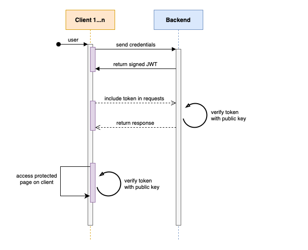

# Blockchain Auth Demo

The monorepo for Blockchain Auth Demo application and shared packages.

## Installation

### Prerequisites

1. **Node, version22** - recommend using [`nvm`](https://github.com/nvm-sh/nvm) to manage multiple versions of Node
2. **[`pnpm`](https://pnpm.io), version 10** - recommend using [Corepack](https://pnpm.io/installation#using-corepack) to install it
3. Ensure you have the `.env` files for the applications, generate the keys using `./scripts/generate-keys.ts`

### Dependencies

1. From the root directory, run:
   ```
   pnpm install
   ```

## Run

1. From the root directory, run `pnpm dev` to start the apps

## Auth

The backend acts as the Identifty Provider (IdP) for the web apps. The web apps authenticate through the backend which then issues a JWT token to the client. The client uses this access token to authenticate with the backend for all subsequent requests. It uses `ES256` algorithm to sign the JWT token that provides a public / private key pair to verify the token. The clients can verify their token using the public key provided by the backend without having to communicate with the backend.



The public and private keys are encoded to base64 and stored in the environment variables. They should be rotated every once in awhile. Generating the keys can be done using the script at `./scripts/generate-key.sh`. The backend needs both the private and public keys. All the other apps need ONLY the public key to verify, since they will only verify not sign anything.

## Notes

1. The monorepo uses _pnpm workspaces_ to manage apps and packages. The root scripts are convenience commands that run sub-package commands. To run a command for a specific package, use the `pnpm --filter` command and the name of the package, such as: `pnpm --filter '@hike/consumer-web' build`
2. [Turbo build](https://turbo.build) is used to optimize tasks.
